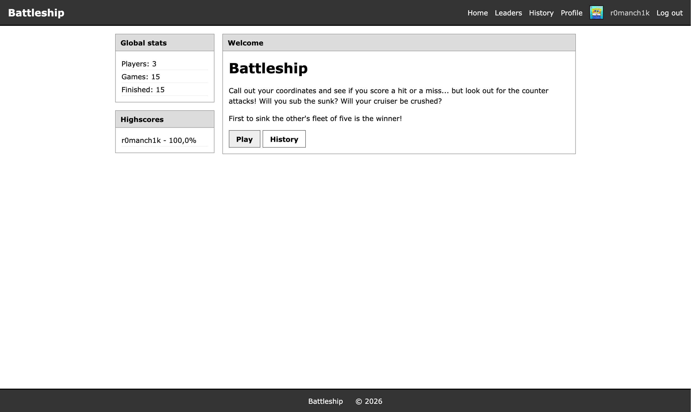
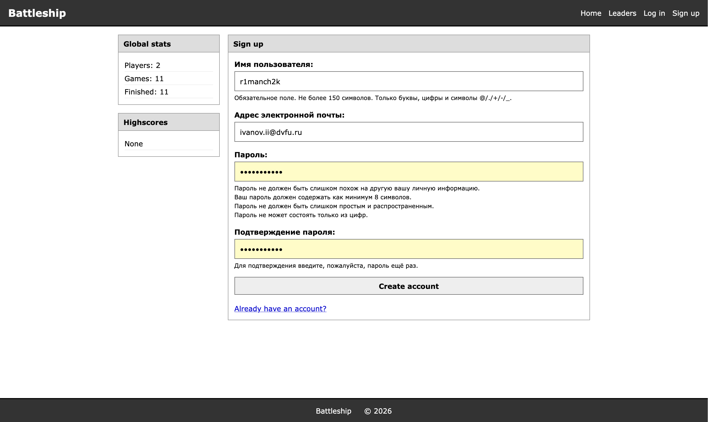
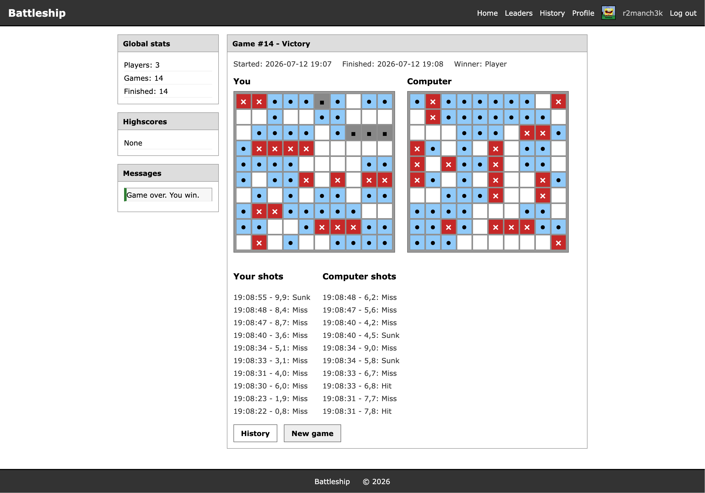
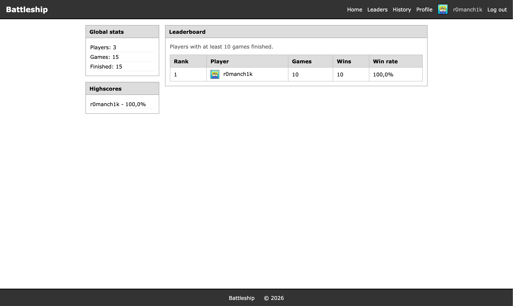

# battleship

Морской бой. Проект для летней практики.

**Технологии**

- uv 0.11.7
- python 3.12
- django 6.0.6

## Быстрый старт

Склонировать репозиторий

```
git clone https://github.com/r0manch1k/battleship.git
```

Настроить переменные окружения

```
cp .env.example .env
```

Установить зависимости

```
uv sync
```

А также дополнительные зависимости для разработки (опционально)

```
npm install --save-dev prettier prettier-plugin-jinja-template
```

Запустить приложение

```
make app
```

...в контейнере

```
make up
```

Сделать миграции

```
make migrate
```

Приложение доступно по адресу

```
http://localhost:${APP_PORT}/game
```

## Галерея








